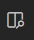

# VS Code Notes
[VS Code](https://code.visualstudio.com/) 
- https://github.com/FourMInfo/DevOps-Space/wiki/VSCode
- https://github.com/MicrosoftDocs/visualstudio-docs/blob/main/docs/ide/writing-code-in-the-code-and-text-editor.md 
- [VS Code Snippets](https://code.visualstudio.com/docs/editor/userdefinedsnippets)  
[VSCode Magazine](https://visualstudiomagazine.com/ )

### Training Available
[VSCode Crash Course (James Q Quick)](https://www.youtube.com/watch?v=WPqXP_kLzpo) 

## Add-Ins & Extensions
### Common Extensions  
- [Extensions for the Visual Studio](https://marketplace.visualstudio.com/)  
- [ESLint](https://marketplace.visualstudio.com/items?itemName=dbaeumer.vscode-eslint)  
  - [ESLint on GH](https://github.com/eslint/eslint) 
- [GitLens](https://marketplace.visualstudio.com/items?itemName=eamodio.gitlens)  
- Live Server
- [Markdown All in One](https://marketplace.visualstudio.com/items?itemName=yzhang.markdown-all-in-one)
- [Markdown Lint](https://marketplace.visualstudio.com/items?itemName=DavidAnson.vscode-markdownlint)  
- [Markdown Shortcuts](https://marketplace.visualstudio.com/items?itemName=mdickin.markdown-shortcuts)  
- [Prettier code formatter extension](https://marketplace.visualstudio.com/items?itemName=esbenp.prettier-vscode) 
  - [Prettier on GH](https://github.com/prettier/prettier) 

- [Prettier Standard](https://marketplace.visualstudio.com/items?itemName=numso.prettier-standard-vscode)  
- [Rainbow Brackets](https://marketplace.visualstudio.com/items?itemName=2gua.rainbow-brackets)  
- [Rainbow Highlighter](https://marketplace.visualstudio.com/items?itemName=cobaltblu27.rainbow-highlighter)  

#### EMMET
[Emmet](https://www.emmet.io/) - a set of plug-ins for text editors that allow for high-speed coding and editing in HTML, XML, XSL, and other structured code formats via content assist.
- [CSS Abbreviations](https://docs.emmet.io/css-abbreviations/)
- [Emmet Docs Cheatsheet](https://docs.emmet.io/cheat-sheet/) 
- [Emmet HTML Cheatsheet](https://github.com/jamesqquick/emmet-html-snippets-cheatsheet)
- [VS Code Guide (CSS, HTML)](https://code.visualstudio.com/docs/editor/emmet)

## Folders used by VS Code
| Folder | Location |  
| --- | --- |  
| Extensions (Windows) | `%USERPROFILE%\.vscode\extensions\` |  
| Global Installer |`C:\Program Files\Microsoft` VS Code (64-bit systems)   `C:\Program Files(x86)\Microsoft VS Code` (32-bit systems) |  
| Repositories |User Selectable|  
| User-Level Installer |`C:\Users\%USERNAME\AppData\Local\Programs\Microsoft VS Code`|  

## Keyboard Shortcuts
- [Keyboard shortcuts (Windows)](https://code.visualstudio.com/shortcuts/keyboard-shortcuts-windows.pdf)

| Action | Shortcut |  
| --- | --- |  
| Add Edit Points | `[ALT] + (Click)` |  
| Add New Line from any point | `[CTRL] + [ENTER]` |  
| Auto Completion with Emmet & Code Snippets | `[CTRL] + [SPACE]`   `[TAB]` or `[ENTER]` | 
| Close Window | `[CTRL] + W` |  
| Color Themes | File ➤ Preferences ➤ Color Theme |  
| Comment selected line(s) | `[CTRL] + /` |  
| Copy   Cut   Paste | `[CTRL] + C`   `[CTRL] + X`   `[CTRL] + P` |  
| Find & Replace | `[CTRL] + [SHIFT] + F` (for Find)   `[CTRL] + R` (Must be set up)   `SHIFT + ALT+ [RIGHT/LEFT ARROW]` (Expand Selection)|  
| Go to file | `[CTRL] + P` |  
| Indent selection | `[CTRL] + ]` |   
| Jump to matching bracket | `[CTRL] + SHIFT + \` |  
| Localization Support | `View ➤ Command Palette, then type the following command: Configure Display Language (Opens locale.json)` |  
| Merge file group | `[CTRL] + [SHIFT] + [LEFT ARROW]` |  
| Minimap | View ➤ Toggle Minimap |  
| Open CLI in VSCode | `[CTRL] + ~` |  
| Open **Command Palette**   Show all commands | `[F1]`   `[CTRL] + [SHIFT] + P`   View ➤ Command Palette |  
| Open Debug Viewlet | `[F5]`   `[CTRL] + [SHIFT] + D` | 
| Open Folder | `[CTRL] + K, [CTRL] + O` | 
| Open **keyboard shortcut** list | `[CTRL] + K, [CTRL] + S` | 
| Open Markdown Preview | `[CTRL] + [SHIFT] + V` |   
| Open Markdown Preview (Side/Side) | `[CTRL] + K – V`   or click in the tab bar:   |  
| Open the VBE Palette for Command-Process-Script actions   |`[CTRL] + [SHIFT] + P `|  
| Preview Markdown | `[CTRL] + [SHIFT] + V` | 
| Reload Document | `[CTRL] + R` |  
| Remove one indent of selection. |`[CTRL] + [` |   
| Run Build Task | `[CTRL] + [SHIFT] + B` | 
| Save Current file |  `[CTRL] + S` |  
| Select Whole Words | `[CTRL] + D` | 
| Settings | `[CTRL] + ,`  (comma)   File ➤ Preferences ➤ Settings|  
| Super replace | `[CTRL] + D` |  
| Switch groups  | `[CTRL] + K, [CTRL] + [LEFT/RIGHT ARROW]`   (also `[CTRL] + 1`, `[CTRL] + 2`, etc.)| 
| Switch Panel Menu | `[CTRL] + Q` |  
| Switch Window Menu | `[CTRL] + [TAB]` |  
| Toggle Comment | `[CTRL] + /`] |
| Toggle terminal | `[CTRL] + \` ` |  
| WHite Space | View ➤ Toggle Render Whitespace |  
| Wrap Text | `[ALT] + Z` |  
| Zoom In & Out | `[CTRL] + +` (minus for In)   `[CTRL] + -` (plus for Out) |  

## Processes
| Process | Actions |  
| -- | -- |  
| Access VS Code Settings | Open Command Palette; Type "Settings" and Select "Open User Settings" |  
| Enable the Soft Wrapping | "View" -> "Toggle Soft Wrap" |  

### Open DOCX in VS Code  
https://marketplace.visualstudio.com/items?itemName=cweijan.vscode-office  
https://marketplace.visualstudio.com/items?itemName=docsmsft.docs-authoring-pack (Markdown)  
https://marketplace.visualstudio.com/items?itemName=bsivanov.OpenXMLPackageEditorforVisualStudio (OpenXML – docx, xlsx, pptx, …)  

## Themes
- [VS Code Themes](https://vscodethemes.com/)  

