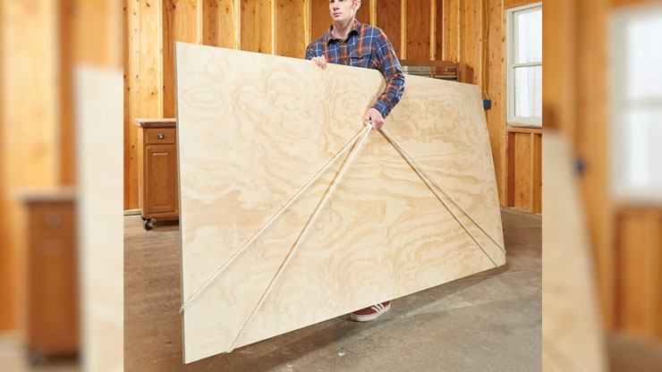

# Tips & Tricks

## Clear a Drain
1.	Pour salt and boiling water down your sink to unclog the drain.
2.	Pour baking soda and hydrogen peroxide down your sink to clear out any gunk in the drain.

## Carry Large Pieces of Wood  
Use a rope to wrap around both corners for an extra hand.

